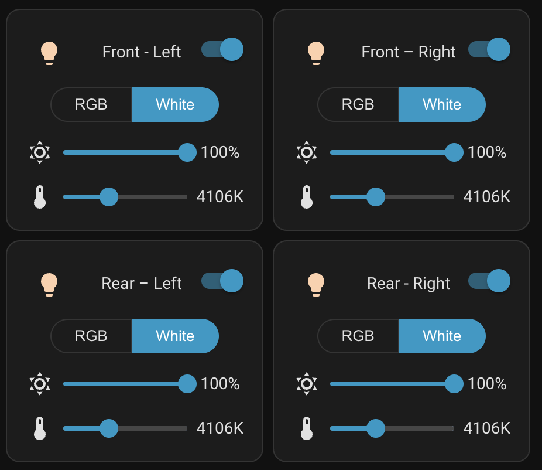
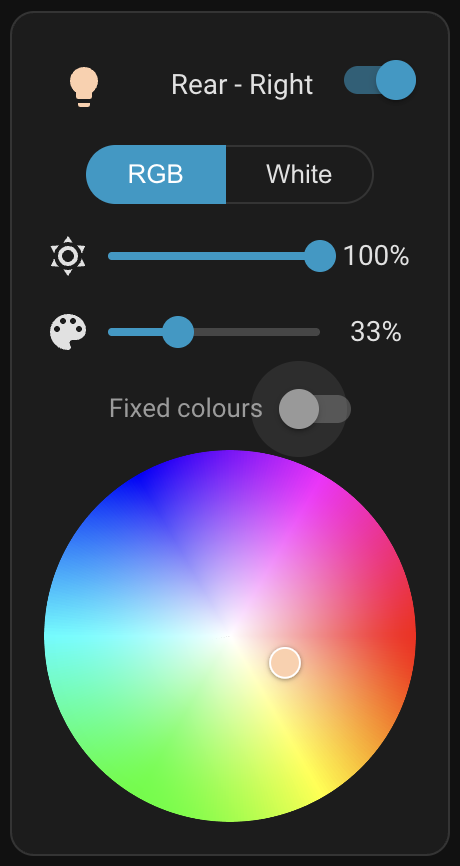
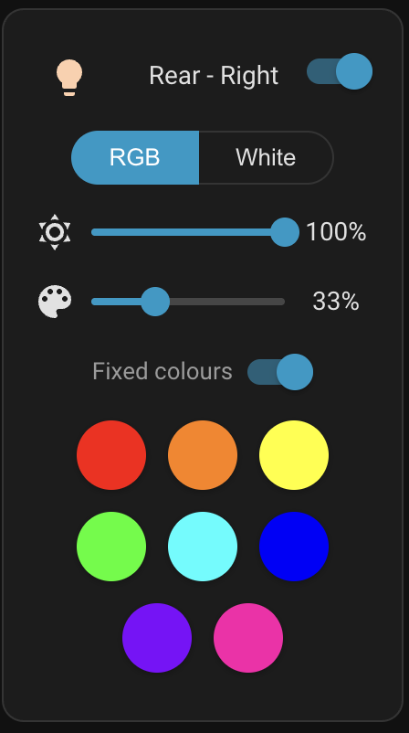
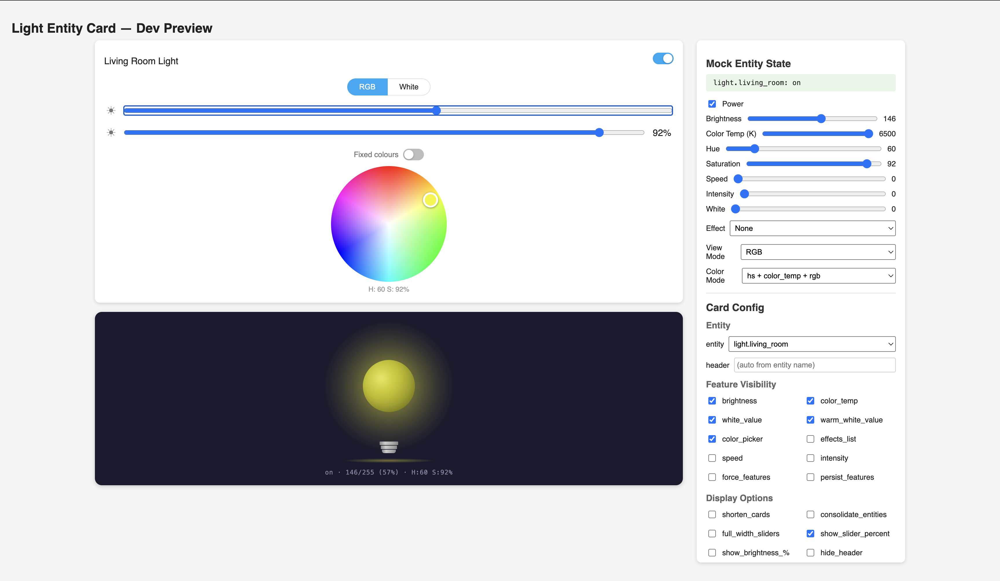

# RGB Light Controller

A feature-rich custom card for [Home Assistant](https://www.home-assistant.io/) that gives you full control over any light or switch entity.

[![GitHub Release][releases-shield]][releases]
[![License][license-shield]](LICENSE.md)
![Project Maintenance][maintenance-shield]
[![HACS][hacs-shield]][hacs]

<p align="center">
  
</p>

## Features

**Color control**
- HS color wheel for precise color picking
- 8 preset color dots (red, orange, yellow, green, cyan, blue, purple, pink)
- Toggle between preset dots and color wheel views
- Saturation slider

**White / color temperature**
- Color temperature slider labelled in Kelvin
- Configurable min/max Kelvin range
- White channel and warm white channel sliders (RGBW / RGBWW)
- Fixed white mode option

<p align="center">
  
  
</p>

**RGB / White mode switching**
- One-tap toggle between RGB and White modes
- Automatically saves and restores your last color and temperature when switching

**Sliders & effects**
- Brightness, speed, and intensity sliders with optional percentage labels
- Effects list from custom entries, an `input_select` entity, or the light's built-in effects

**Layout & UI**
- Compact card mode for grouped entities
- Full-width sliders option
- Customizable header, icons, and per-slider visibility
- Child card mode (nested inside other cards)
- Multi-language support

## Installation

Install via [HACS](https://hacs.xyz/) (search for **RGB Light Controller**).

For help, visit the [community support thread](https://community.home-assistant.io/t/light-entity-card/96146).

## Quick start

```yaml
type: custom:light-entity-card
entity: light.living_room
```

## Configuration examples

**Custom effects list**

```yaml
type: custom:light-entity-card
entity: light.downstairs
effects_list:
  - effect1
  - effect2
```

**Effects from an input_select**

```yaml
type: custom:light-entity-card
entity: light.downstairs
effects_list: input_select.custom_effect_list
```

**Compact grouped card**

```yaml
type: custom:light-entity-card
entity: light.downstairs
shorten_cards: true
consolidate_entities: true
```

**Full-width sliders with percentages**

```yaml
type: custom:light-entity-card
entity: light.strip
full_width_sliders: true
show_slider_percent: true
```

## Options

| Name | Type | Default | Description |
| --- | --- | --- | --- |
| `type` | string | **required** | `custom:light-entity-card` |
| `entity` | string | **required** | Light or switch entity ID |
| `header` | string | entity name | Custom header text |
| `hide_header` | boolean | `false` | Hide the card header and toggle |
| `show_header_icon` | boolean | `false` | Show entity icon in the header |
| `child_card` | boolean | `false` | Remove padding for nesting inside another card |
| `shorten_cards` | boolean | `false` | Compact card layout |
| `consolidate_entities` | boolean | `false` | Merge a group entity into one card |
| `persist_features` | boolean | `false` | Always show controls even when the light is off |
| `force_features` | boolean | `false` | Force-show all available controls |
| `brightness` | boolean | `true` | Show brightness slider |
| `color_temp` | boolean | `true` | Show color temperature slider (Kelvin) |
| `white_value` | boolean | `true` | Show white channel slider |
| `warm_white_value` | boolean | `true` | Show warm white channel slider |
| `color_picker` | boolean | `true` | Show the color picker |
| `effects_list` | list/string/bool | `false` | Custom effects list, `input_select` entity, or `true` for built-in |
| `speed` | boolean | `true` | Show speed slider |
| `intensity` | boolean | `true` | Show intensity slider |
| `fixed_white` | boolean | `false` | White mode shows only brightness (no color temp) |
| `full_width_sliders` | boolean | `false` | Sliders span the full card width |
| `show_slider_percent` | boolean | `false` | Show percentage labels next to sliders |
| `min_color_temp_kelvin` | number | auto | Override minimum Kelvin for color temp slider |
| `max_color_temp_kelvin` | number | auto | Override maximum Kelvin for color temp slider |
| `transition` | number | `0` | Transition duration in seconds |
| `brightness_icon` | string | `weather-sunny` | Brightness slider icon |
| `white_icon` | string | `file-word-box` | White channel slider icon |
| `warm_white_icon` | string | `weather-sunset` | Warm white channel slider icon |
| `temperature_icon` | string | `thermometer` | Color temperature slider icon |
| `speed_icon` | string | `speedometer` | Speed slider icon |
| `intensity_icon` | string | `transit-connection-horizontal` | Intensity slider icon |

## Development

```bash
npm install
npm run start
```

This starts a local dev server with a mock Home Assistant environment where you can test the card without a real HA instance.

<p align="center">
  
</p>

To build for production:

```bash
npm run build
```

The bundled output is written to `dist/rgb-light-controller.js`.

---

Enjoy the card? Help me out for a couple of :beers: or a :coffee:!

[](https://www.buymeacoffee.com/JMISm06AD)

[releases-shield]: https://img.shields.io/github/release/Antonio112009/rgb-light-control.svg?style=for-the-badge
[releases]: https://github.com/Antonio112009/rgb-light-control/releases
[license-shield]: https://img.shields.io/github/license/Antonio112009/rgb-light-control.svg?style=for-the-badge
[maintenance-shield]: https://img.shields.io/badge/maintainer-%40Antonio112009-blue.svg?style=for-the-badge
[hacs-shield]: https://img.shields.io/badge/HACS-Default-orange.svg?style=for-the-badge
[hacs]: https://github.com/hacs/integration
